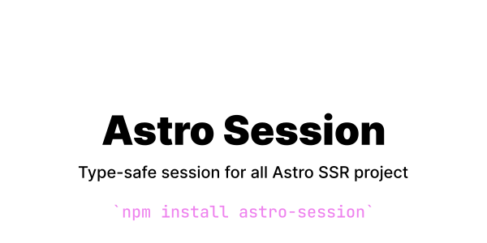

## Why use Astro Session?

When building server application with Astro, you will often need session system to identify request coming from the same user. It's commonly used for authenticating users.

Astro Session provide a per route basis API to manage session on different provider (highly inspired by [Remix](https://remix.run/)).

In addition, we leverage TypeScript to provide a fully type-safe session system across your project.

## Getting Started

### Settings up a session storage

We recommend setting up you session storage in `src/session.ts`.

```ts
// src/session.ts
import { createCookieSessionStorage } from "astro-session";

// your session data type which define the shape of your session data
export type SessionData = {
  count: number;
  user: User | null;
};

export const { getSession, commitSession } =
  createCookieSessionStorage<SessionData>(
    { count: 0, user: null }, // the default value on new session created, this must match your SessionData

    {
      cookie: {
        // all of these are optional
        name: "__session-id",
        path: "/",
        secret: "not-secret", // even if optional, this is mandatory when passing your app in production
      },
    }
  );
```

### Using the session in an astro file

The input/output to a session storage object are HTTP cookies. `getSession()` retrieves the current session from the incoming request's Cookie header, and `commitSession()`/`destroySession()` provide the `Set-Cookie` header for the outgoing response.

```astro
---
// src/pages/index.astro
import { getSession, commitSession } from "../session"

// get the session
const session = await getSession(Astro.request);

// update specific value in the session
session.set('count', session.get('count') + 1);
// or
// session.set('count', (value) => value + 1);

// get specific value in the session
const count = session.get('count');

// save the session in the cookie (mandatory to persist data from one request to another)
Astro.response.headers.set("set-cookie", await commitSession(session));
---

<p>You visited this page: {{ count }}</p>
```

### Using session in a API endpoint

A login workflow might look like this:

```ts
// src/routes/api/login.ts
import type { APIContext } from "astro";
import { commitSession, getSession } from "../../utils/session";

export async function post({ request }: APIContext) {
  const session = await getSession(request);
  const formData = await request.formData();

  const email = formData.get("email");
  const password = formData.get("password");

  // checks for email + password combinaison
  const user = await validateCredentials(email, password);

  if (!user) {
    // if email or password incorrect, flash a message to show the user what is the error
    session.flash("error", "Invalid email/password");

    return new Response(null, {
      status: 302,
      headers: {
        location: "/login",
        // commit the session to persist it
        "set-cookie": await commitSession(session),
      },
    });
  }

  // if the credentials are valid, save the user in session
  session.set("user", user);

  // redirect to the dashboard
  return new Response(null, {
    status: 302,
    headers: {
      location: "/dashboard",
      // commit the session to persist it
      "set-cookie": await commitSession(session),
    },
  });
}
```

And in our page:

```astro
---
// src/routes/login.astro
import { getSession, commitSession } from "astro-session";

const session = await getSession(Astro.request);

// if the user is already authenticated, redirect to the dashboard
if (!session.get('user')) {
  return Astro.redirect('/dashboard')
}

// get the error message if there is any and delete it after accessing it
// flash data are accessible only once and get deleted after
const error = session.flash('error');

// persist the session data
Astro.response.headers.set("set-cookie", await commitSession(session));
---

<!-- display error if there is any in the session -->
{!!error && <p>{error}</p>}

<form method="post" action="/api/login">
  <input name="email" type="email" placeholder="Email" />

  <input name="password" type="password" placeholder="Password" />

  <button type="submit">Login</button>
</form>
```

## FAQ / Gotchas

### What is the difference between normal data and flash data?

Flash data are only accessible once and are deleted just after. They are used for passing down data to the next page for success / error message for example.

### Your question is not listed?

We make sure to include as much information in this section as possible. If you didn't find an answer here, feel free to open an issue with your question and we will be happy to guide you out!

## Credits

Astro Session took a lot of inspirations from [Remix](https://remix.run/) session API and [Fresh Session](https://github.com/xstevenyung/fresh-session)
